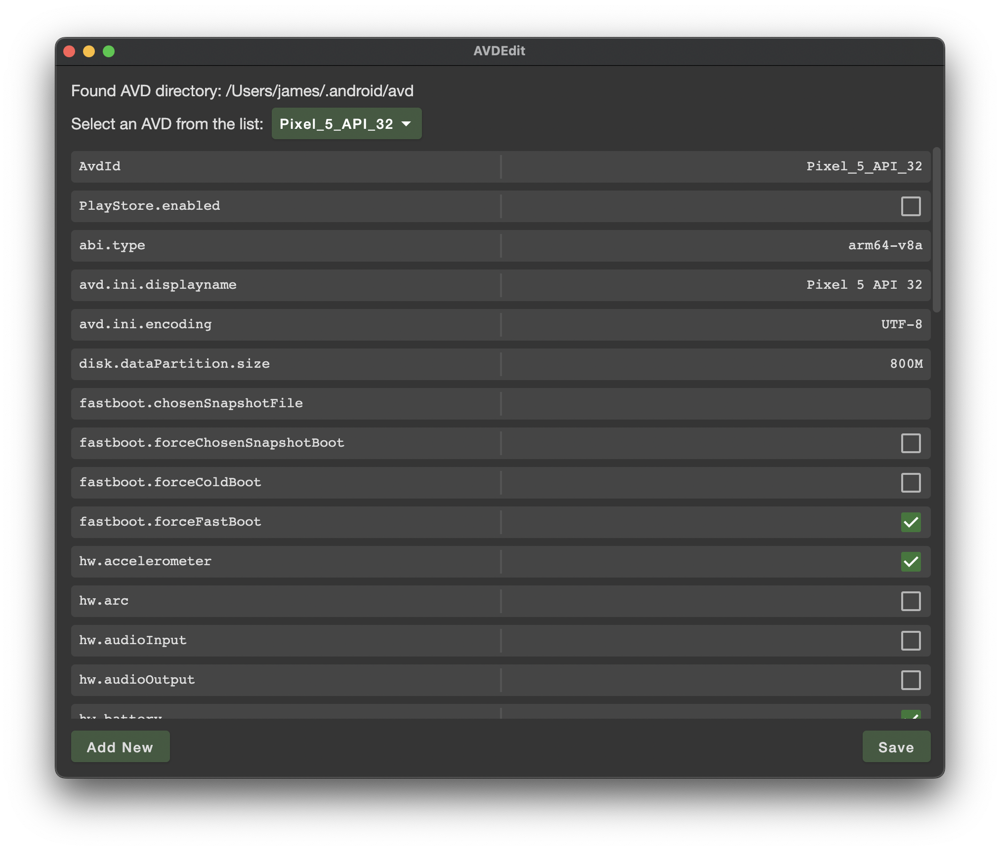

# AVDEdit
AVDEdit is a basic Android Virtual Device editor which allows direct editing of values which are not editable or accessible via the standard AVD Manager.

## Feature todo list

- [x] Allow selection of AVD
- [x] Display list of config settings with checkboxes for true/false/yes/no values
- [x] Functionality to edit existing and add new config settings
- [x] Save function
- [ ] Allow user to choose their AVD directory instead of using platform default
- [ ] Provide a way to delete settings

## Motivation
I created this app out of frustration that running a single Android emulator would frequently see my CPU pegged at 500-800% for no reason, killing my MacBook's battery very quickly.

While investigating this behaviour I found [this StackOverflow answer](https://stackoverflow.com/a/42203744) which outlined a few mystical AVD settings which can be set by editing a config file, but not by using the actual AVD Manager provided by Android Studio.

Despite my skepticism, I tried disabling `hw.audioInput` and `hw.audioOutput` and sure enough it really did put an end to the constant inexplicably high CPU usage by the emulator.

I could have spent time trying to understand *why* certain settings created this problem, but realistically I don't care, I just want to get things done without the emulator nuking my battery, and it was a great excuse to learn more about Compose for Desktop. 